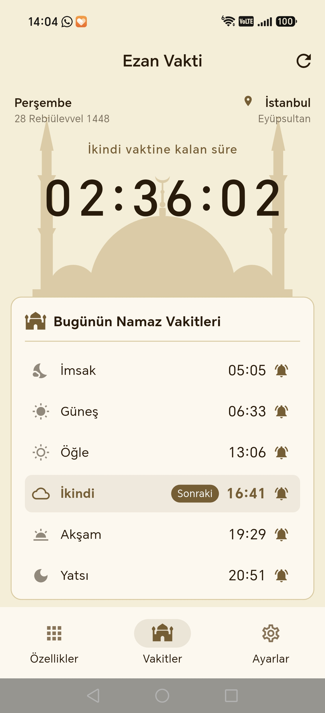
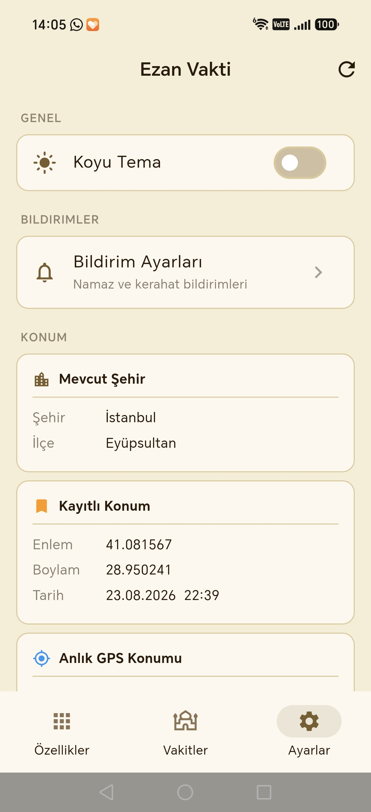
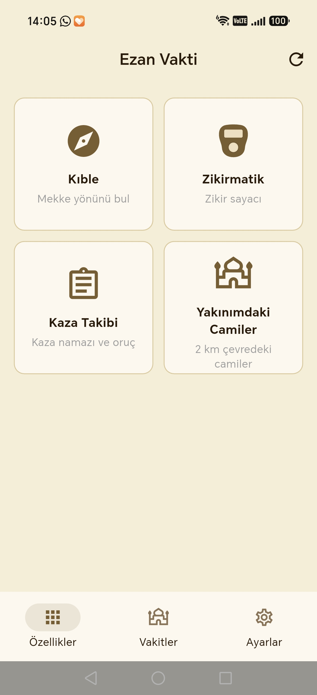
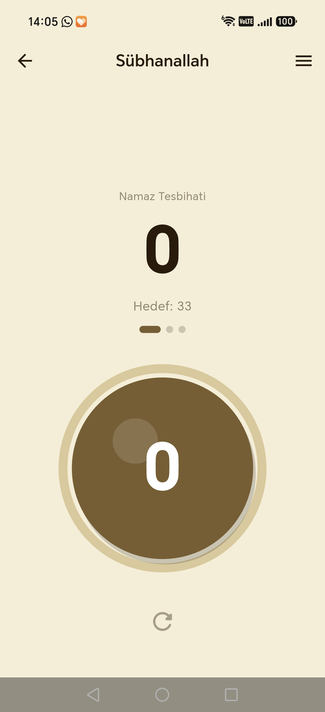
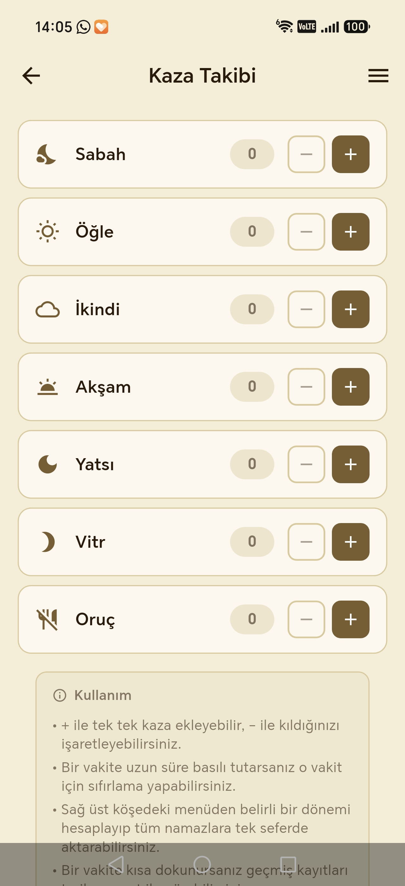
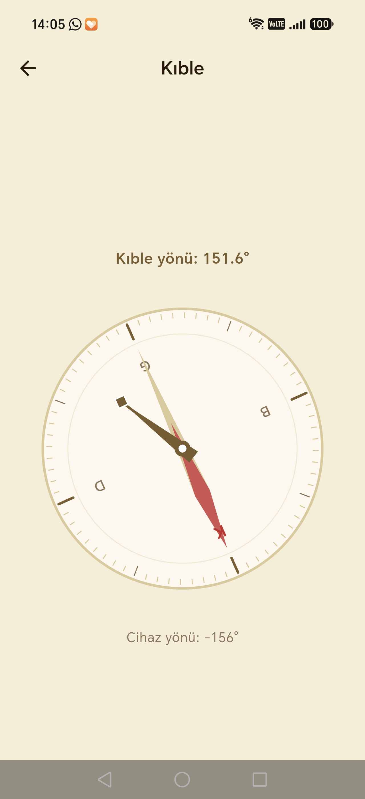
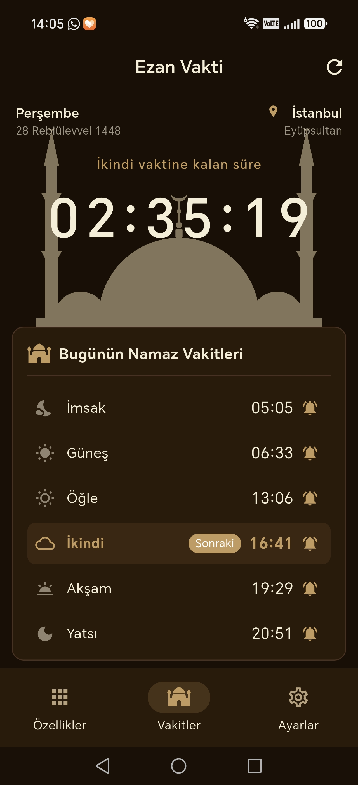
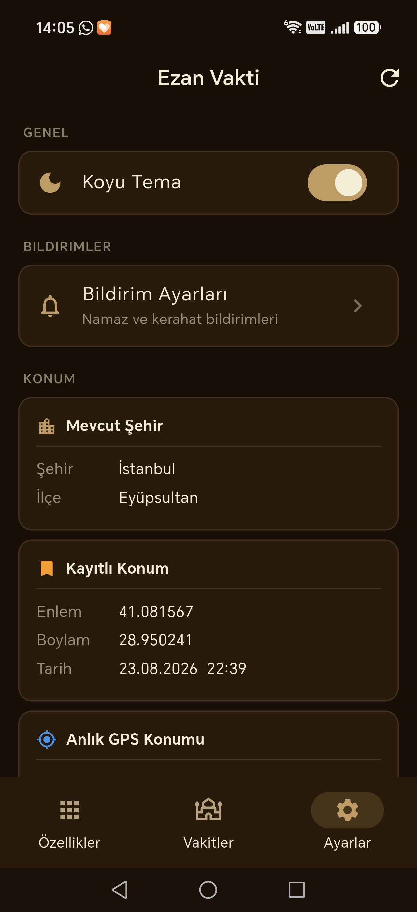

# Ezan Vakti

Türkiye'deki namaz vakitlerini takip etmek için geliştirilmiş Flutter uygulaması. Açık ve koyu tema desteği, ana ekran widget'ı ve çeşitli İslami araçlar içerir.

---

## Özellikler

### Namaz Vakitleri
- İmsak, Güneş, Öğle, İkindi, Akşam, Yatsı vakitlerini gösterir
- Şehre göre otomatik vakit hesaplama
- Şu anki aktif vakit vurgusu

### Ana Ekran Widget'ı
- 6 vakit tek bakışta görünür
- **Açık tema** ve **koyu tema** olmak üzere iki ayrı widget
- 2×2 boyutunda kompakt görünüm; büyütüldüğünde daha geniş ve okunaklı tasarım
- Aktif vakti renkli olarak vurgular
- Üzerindeki ↻ butonuyla anlık güncelleme
- Android 12+ için canlı widget önizlemesi

### Kıble
- Pusula ile Mekke yönünü gösterir
- Anlık yön takibi

### Zikirmatik
- Özel zikir oluşturma ve kaydetme
- Sayaç ile zikir takibi

### Kaza Takibi
- Kaza namazı ve oruç takibi
- Kaçan ibadetleri kayıt altında tutar

### Yakınımdaki Camiler
- 2 km çevresindeki camileri listeler

### Bildirimler
- Namaz vakti bildirimleri
- Her vakit için ayrı ayrı açılıp kapatılabilir

---

## Teknik Bilgiler

- **Framework:** Flutter
- **Platform:** Android (iOS desteği yakında)
- **Minimum Android:** API 21 (Android 5.0)
- **Widget:** home_widget paketi, `HomeWidgetProvider` tabanlı

---

## Kurulum

```bash
flutter pub get
flutter run
```

Widget'ı test etmek için release benzeri bir build gerekebilir:

```bash
flutter run --profile
```

---

## Ekran Görüntüleri

<table>
  <tr>
    <td></td>
    <td></td>
  </tr>
  <tr>
    <td></td>
    <td></td>
  </tr>
  <tr>
    <td></td>
    <td></td>
  </tr>
  <tr>
    <td></td>
    <td></td>
  </tr>
</table>

---

## Lisans

Bu proje kişisel kullanım amaçlıdır.
